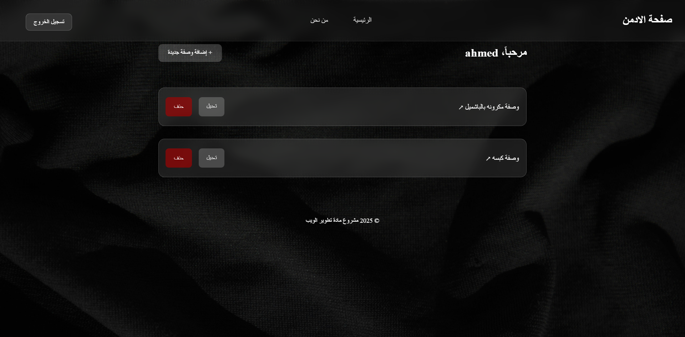

# Recipe Website

This is a recipe-sharing website where master-class chefs can post their recipes for users to explore and try out. The website is built using Node.js, Express.js, and MongoDB, with additional libraries for enhanced functionality and security.

## Features
- User authentication using JSON Web Tokens (JWT) and bcrypt for password hashing.
- Dynamic views with EJS templates for rendering content.
- Session management with express-session and connect-mongo.
- MongoDB for database integration.
- Method override for supporting PUT and DELETE HTTP verbs in forms.

## Requirements
- Node.js (v16 or higher)
- MongoDB (local or cloud instance)

## Setup Instructions

1. Clone the repository:
   ```bash
   git clone <repository-url>
   cd <repository-folder>
   ```

2. Install dependencies:
   ```bash
   npm install
   ```

3. Create a `.env` file in the root directory and add the following:
   ```env
   MONGODB_URI=<your-mongodb-connection-string>
   JWT_SECRET=<your-jwt-secret>
   ```
   Replace `<your-mongodb-connection-string>` and `<your-jwt-secret>` with your details.

4. Start the application:
   ```bash
   npm start
   ```

5. Access the website at `http://localhost:3000`.

## Libraries Used
- bcrypt: ^5.1.0
- connect-mongo: ^5.0.0
- cookie-parser: ^1.4.6
- dotenv: ^16.0.3
- ejs: ^3.1.9
- express: ^4.18.2
- express-ejs-layouts: ^2.5.1
- express-session: ^1.17.3
- jsonwebtoken: ^9.0.0
- method-override: ^3.0.0
- mongoose: ^7.0.3


## Screenshots





## student
```
this project was made for cs-346 in Imam Mohammad Ibn Saud Islamic University 
students:
ahmed aldayel 444001776
Abdurabu Saleh Abdurabu Ali 443018831
Abdulaziz Jamal Alyasin 442016211
Moayad mohammed Fagihi 441015220


